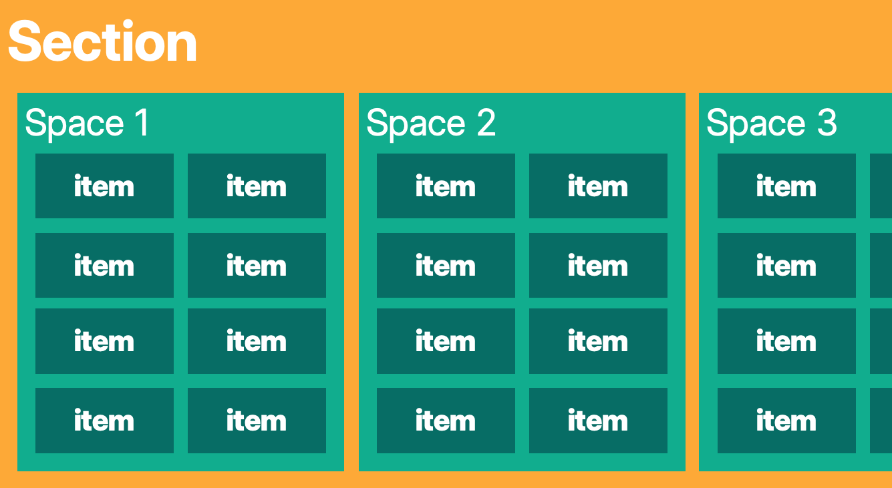

# Sherlock

Inventories and sorting for the rest of us. Seriously.

## What is this?
An intuitive (hopefully) inventory application built with Ruby on Rails.  Items are put into spaces (drawers, cupboards, etc.), which are then organised into sections. Sherlock auto-generates labels with QR codes/barcodes for all of them.

## What you can do
- Index your inventories.
- Print out labels for sections, spaces, and items.
- (future release) Search through your inventories.
- (future release) Scan labels of indexed items to find out where they belong.

## Getting Started
- Downloading
    - Clone this repository with git clone: `git clone https://github.com/SumukhPrasad/Sherlock.git`
    - Download and copy WOFF2 fonts for *Inter Display* and *Source Serif 4* in the manner specified by [Fonts.md](./Fonts.MD)
- Setting Up
    - Set up and install dependencies: `bundle install`
    - Set your email address and password for Devise's mailer:
        - `EDITOR=vim rails credentials:edit` (To see which credentials map to which parameters, see [this file](config/environments/development.rb))
        - Then, copy and fill in the contents of `credentials.yml-template`
    - Migrate the database using `rails db:migrate`
    - Run `rails server` to start up.
